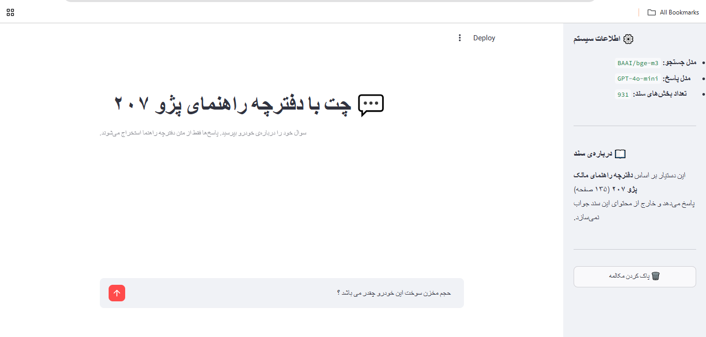
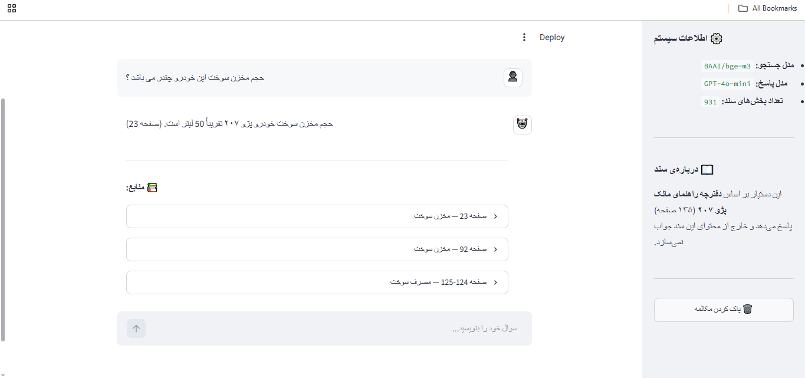
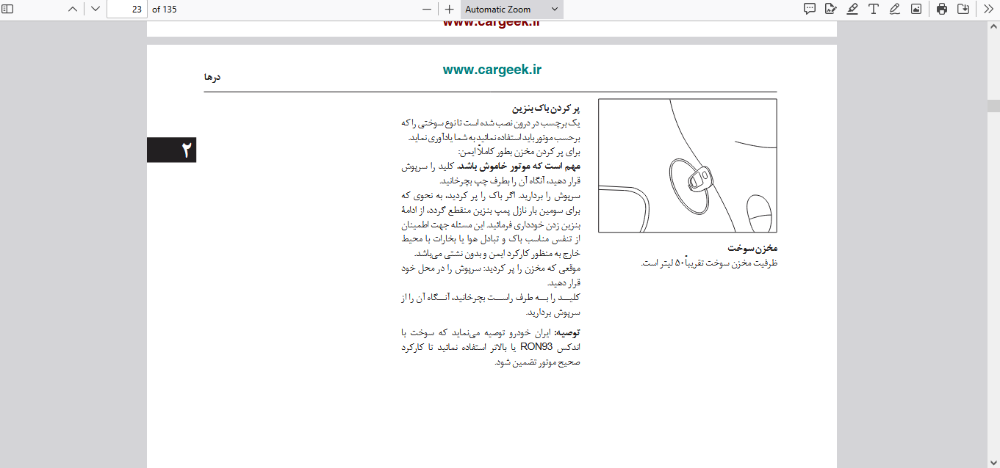

# 🚗 Chat with PDF — دستیار هوشمند دفترچه راهنمای پژو ۲۰۷
<div dir="rtl">

## درباره‌ی این پروژه

این سیستم **RAG فارسی** برای پرسش و پاسخ هوشمند از دفترچه راهنمای مالک پژو ۲۰۷ طراحی شده.
تمرکز اصلی روی چالش‌های واقعی پردازش PDF فارسی بود: اصلاح RTL، هدرهای تکراری صفحات،
تشخیص جدول، و مشکل مترادف‌های فارسی (مثل «باک» در مقابل «مخزن سوخت»).

</div>

---

# 🚗 Chat with PDF — Peugeot 207 Manual Assistant

A **Persian-language RAG system** for intelligent Q&A on the Peugeot 207 owner's manual (135 pages), with full RTL support and real-world Persian PDF processing challenges solved.

[](https://python.org)
[](https://streamlit.io)
[](https://fastapi.tiangolo.com)
[](LICENSE)

---

## 📌 Overview

This project implements a production-ready RAG pipeline for **Persian text**, going beyond typical RAG tutorials by solving real-world challenges specific to Persian PDF documents.

**Evaluation Results:**
- 🎯 Retrieval Accuracy: **~93%** on 15-question test set
- 💬 Answer Accuracy: **~80%** (accounting for Persian synonyms)

---

## 🔍 What Makes This Different?

Most RAG tutorials skip the hard parts. Here's what was actually solved:

### 1. Persian RTL Character Ordering
PDF libraries sometimes extract Persian characters in reverse order. The fix: a custom `fix_persian_rtl()` function that only reverses pure Persian tokens, leaving numbers and Latin text untouched.

```python
# Problem: 'یلدنص تیعقوم'  →  Fixed: 'موقعیت صندلی'
# Only reverses purely Persian tokens — numbers/Latin stay intact
```

### 2. Repeating Page Headers
Chapter names repeat at the top of every page and were incorrectly detected as content headings. This caused unrelated topics to merge into the same chunk.

**Fix:** Filter lines where `y_position < 8%` of page height — these are always headers, never content.

### 3. Persian Synonyms in Embedding
"ظرفیت **باک** بنزین" and "ظرفیت **مخزن سوخت**" mean the same thing, but weaker embedding models don't recognize this. Discovered through real testing — fixed by switching to BGE-m3, the top-ranked model on the Persian-specific FaMTEB benchmark.

### 4. Table Content Duplication
`find_tables()` and `get_text()` both extract table content, causing duplication. Fix: filter text blocks whose bounding box overlaps with detected table regions.

### 5. False Positive Table Detection
`find_tables()` sometimes misidentifies cover page text as a table. Fix: reject tables where >50% of cells are empty.

---

## 🏗️ Architecture

```
PDF (135 pages)
      │
      ▼
┌─────────────────────────────────────┐
│         PDF Processing              │
│  • PyMuPDF (text + table extract)  │
│  • RTL Fix (Persian char ordering) │
│  • Page header filter              │
│  • Table → Markdown conversion     │
└──────────────────┬──────────────────┘
                   │
                   ▼
┌─────────────────────────────────────┐
│    Hierarchical Chunking            │
│                                     │
│  Parent (full section, for LLM)     │
│    ├── Child 1  ← embedded          │
│    ├── Child 2  ← embedded          │
│    └── Child 3  ← embedded          │
│                                     │
│  499 Parents │ 931 Children │ 26 Tables │
└──────────────────┬──────────────────┘
                   │
                   ▼
┌─────────────────────────────────────┐
│         Embedding & Storage         │
│  • BGE-m3 (#1 on Persian FaMTEB)   │
│  • ChromaDB (local vector store)   │
└──────────────────┬──────────────────┘
                   │
             User question
                   │
                   ▼
┌─────────────────────────────────────┐
│           RAG Pipeline              │
│                                     │
│  Search Children (precise)          │
│       ↓                             │
│  Retrieve full Parent (context)     │
│       ↓                             │
│  GPT-4o-mini → Final answer        │
└─────────────────────────────────────┘
```

### Why Parent-Child Chunking?

Standard flat chunking creates a contradiction:
- **Small chunks** → precise embedding, but insufficient LLM context
- **Large chunks** → good context, but noisy embedding

Parent-Child solves this: search at the Child level (precise), answer with the full Parent text (full context).

---

## 🛠️ Tech Stack

| Layer | Tool | Why |
|---|---|---|
| PDF Extraction | PyMuPDF | Best RTL/Persian PDF support |
| Embedding | BGE-m3 (BAAI) | #1 on Persian FaMTEB benchmark |
| Vector Store | ChromaDB | Local, metadata filtering, no server needed |
| LLM | GPT-4o-mini | Cost-effective, good Persian quality |
| UI | Streamlit | Fast deployment with RTL CSS |
| API | FastAPI + Pydantic | Auto-generated Swagger docs |

---

## 📊 Evaluation

15-question test set across multiple categories:

| Category | Example | Result |
|---|---|---|
| `fact_simple` | What is the fuel tank capacity? | ✅ |
| `fact_synonym` | How much does the **gas tank** hold? | ✅ (with BGE-m3) |
| `fact_procedure` | How do you unlock the steering wheel? | ✅ |
| `table_lookup` | What seat type does weight group 0 need? | ✅ |
| `out_of_scope` | What is the recommended oil color? | ✅ (honest refusal) |

**Known limitation:** Aggregative questions (e.g., "how many types of lights does it have?") requiring full-document reading are outside the scope of this RAG architecture. This is an inherent limitation of retrieval-based systems, not a bug.

---

## 🚀 Getting Started

### Prerequisites
- Python 3.11+
- OpenAI API Key

### Installation

```bash
git clone https://github.com/YOUR_USERNAME/peugeot-207-rag.git
cd peugeot-207-rag
pip install -r requirements.txt
```

### Environment Setup

```bash
export OPENAI_API_KEY="sk-..."
```

### One-time Document Processing

```bash
cd src

# Step 1: Build Parent-Child structure
python3 hierarchical_chunking.py

# Step 2: Embed children (downloads BGE-m3 ~2.2GB on first run)
python3 embed_chunks.py

# Step 3: Load into ChromaDB
python3 vector_store.py
```

### Run

```bash
# Streamlit UI
streamlit run app.py

# Or REST API (docs at http://localhost:8000/docs)
uvicorn api:app --reload
```

---

## 📁 Project Structure

```
pdf_chat_project/
├── manual.pdf                        # Source document (Peugeot 207 manual)
├── requirements.txt
├── README.md
└── src/
    ├── persian_text_utils.py         # RTL fix + diagram page detection
    ├── structure_extraction.py       # heading/body/warning detection via font analysis
    ├── page_processor.py             # Per-page processing pipeline
    ├── hierarchical_chunking.py      # Parent-Child chunk builder
    ├── embedding.py                  # BGEEmbedder + OpenAIEmbedder (swappable)
    ├── embed_chunks.py               # Embed all children
    ├── vector_store.py               # ChromaDB wrapper (swappable)
    ├── rag_pipeline.py               # RAGPipeline class (search + answer)
    ├── app.py                        # Streamlit UI
    ├── api.py                        # FastAPI REST API
    ├── eval_questions.json           # 15-question evaluation set
    └── run_evaluation.py             # Automated evaluation runner
```

---

## 🔮 Roadmap

- [ ] **Reranking** with Cross-Encoder for higher precision
- [ ] **Query Expansion** — LLM rewrites query before search
- [ ] **Hybrid Search** — semantic + keyword (BM25) combined
- [ ] **Vision Support** — describe vector diagrams with multimodal model
- [ ] **Deploy** on Streamlit Cloud

---

## 📄 License

MIT License — free to use and extend.

## Demo



